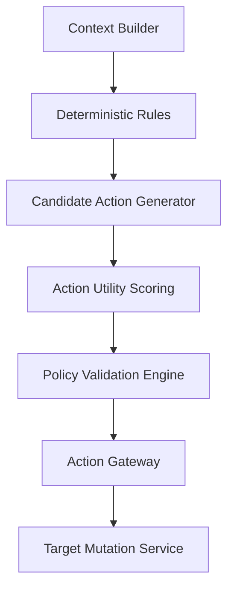

# Agent Decision Engine Architecture

JobPilot's decision-making architecture shifts from execution scripts to a structured cognitive cycle that operates under strict policy verification gates.

## Cognitive Pipeline Flow

1. **Context Building**: Collects candidate fact profiles (user, job, campaign mission config) into a point-in-time snapshot.
2. **Rules Processing**: Runs hard deterministic filters first.
3. **Action Gateway Whitelist**: Only permits execution of declared, audited action targets.
