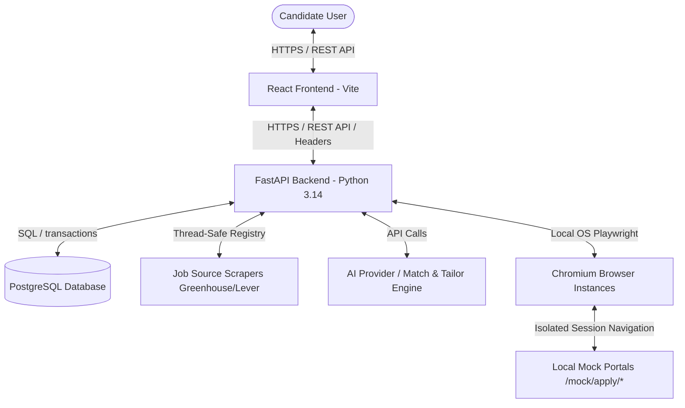

# JobPilot — Production Architecture & Design Patterns

This document details the production-hardened architecture, components, dependencies, data flows, and security boundaries of the JobPilot platform.

## High-Level System Topology

## Security Boundaries & Access Control

1. **API Authorization (IDOR Protection):**
   * Client requests must supply identity credentials via custom headers (`X-User-Id`).
   * API endpoints fetch the corresponding `UserProfile` using this ID and verify that the target resource (Resumes, Applications, Matches) matches the user's `profile_id`. Accessing another user's records is blocked with a `404 Not Found` or `403 Forbidden` response.
2. **SSRF (Server-Side Request Forgery) Protection:**
   * Backend outbound connections are validated by `URLSecurityService`.
   * Loopback (`127.0.0.0/8`, `::1`), private networks (`10.0.0.0/8`, `172.16.0.0/12`, `192.168.0.0/16`), link-local range (`169.254.0.0/16`), and metadata endpoints are blocked from outbound HTTP operations unless local test/dev overrides are active.
3. **Allowed Domain Allowlists:**
   * Applications are executed only on domains explicitly allowed in the `ApplicationSourceConfiguration` associated with the target source.
4. **Browser Isolation:**
   * Every execution session runs in a fresh, isolated `BrowserContext` to prevent sharing local storage, cookies, and session state.

## Database Concurrency & Locking
* To prevent race conditions where two threads attempt to submit the same application, the system obtains a row-level lock (`SELECT ... FOR UPDATE`) on the `Application` record during execution entry. The status transitions atomically to `SUBMITTING` within the transaction bounds before Playwright actions start.
